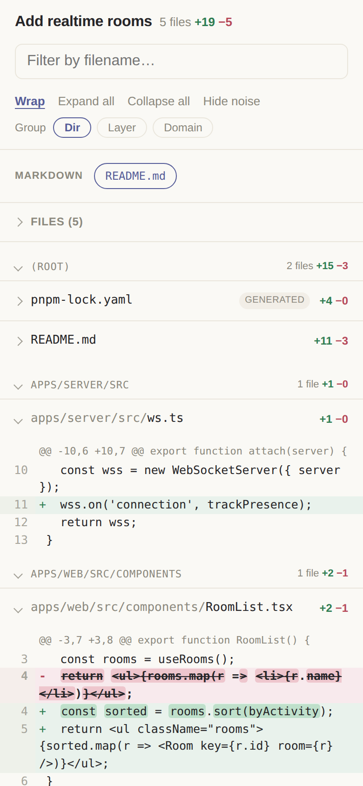
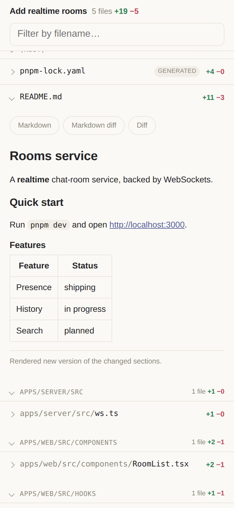
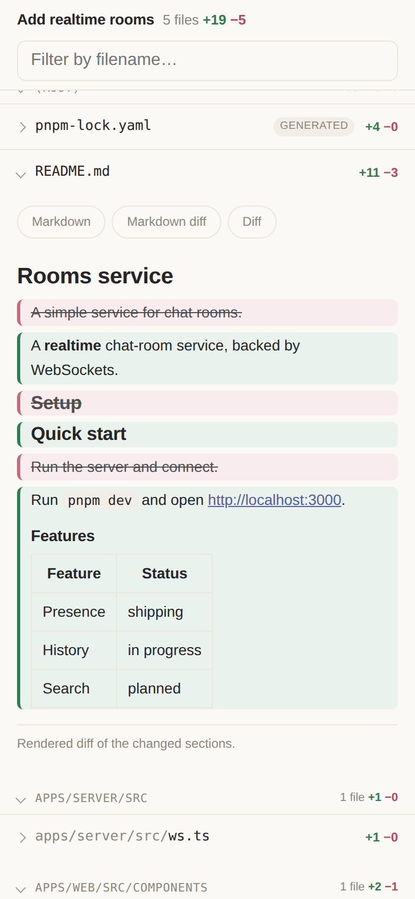
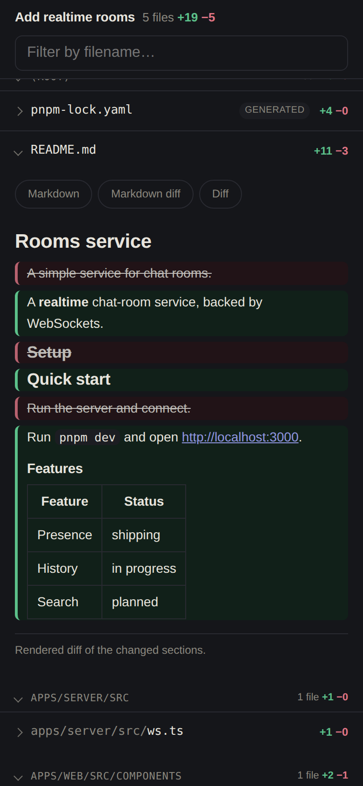
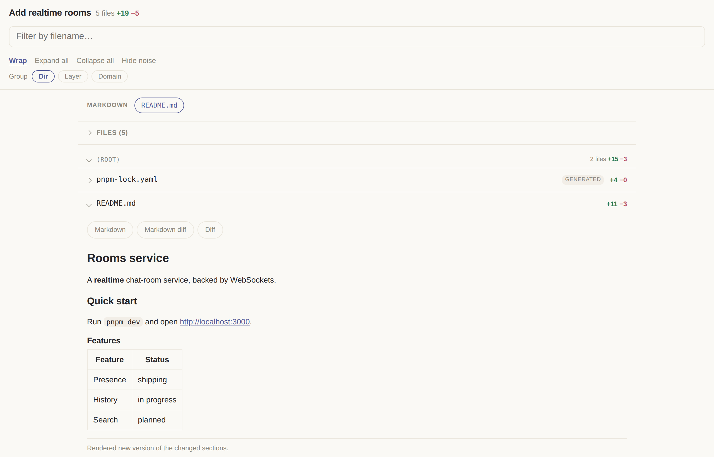

# pocketdiff

### Review code diffs on your phone — actually comfortably.

`pocketdiff` turns any `git diff`, pull request, or commit into **one
self-contained HTML file** built for a small screen: code that doesn't wrap into
mush, noise collapsed, files grouped, markdown rendered. No server, no app, no
internet to open it — pipe a diff in, then AirDrop or download the file and read.

<p align="center">
  
  
  
</p>

<p align="center">
  <em>Left to right: the file index with a collapsed lockfile and word-level
  highlights · a changed markdown file <strong>rendered</strong> · the same file as a
  <strong>rendered diff</strong> (added green, removed struck-through). Dark mode follows the system:</em>
</p>

<p align="center">
  
</p>

```bash
# pipe any diff in — that's it
git diff main...HEAD | npx pocketdiff -o review.html

# …or paste a PR / commit URL (GitHub, GitLab, Bitbucket)
npx pocketdiff -o review.html https://github.com/owner/repo/pull/42
```

**Why?** Reviewing agent-generated and large diffs on GitHub mobile is painful:
lines wrap into mush, lockfiles drown out the real changes, and there's no way to
filter or group. Diffs are getting bigger and more of them are written by AI —
pocketdiff makes reading them on the couch actually bearable.

## Features

- **Mobile- & tablet-friendly** — fluid layout, big tap targets, code scrolls inside
  its own box so the page never overflows. Roomier on tablets/landscape.
- **Noise collapsed by default** — lockfiles (`package-lock.json`, `pnpm-lock.yaml`,
  `go.sum`, `Cargo.lock`, …), minified/generated files, source maps and snapshots
  start collapsed. Real source starts open.
- **Grouped by folder** — files are clustered by directory (a strong proxy for
  "related files") under collapsible group headers.
- **Word-level highlighting** — when a line is edited, the exact words that changed
  are highlighted (great for prose & markdown, helpful everywhere).
- **Markdown views** — `.md`/`.markdown`/`.mdx` files get three tabs:
  **Markdown** (the changed sections rendered as real markdown — headings, tables,
  bold), **Markdown diff** (the same, rendered *with* inline ins/del — added blocks
  green, removed struck-through red), and **Diff** (raw `+`/`−`). Rendered at build
  time via `markdown-it`, so it stays offline. Pure-CSS tabs (work with JS off).
- **Live filename filter** — type to instantly narrow the file list.
- **Word wrap on by default**, plus toggle, expand/collapse all, dark mode.
- **Image previews** — for **local** diffs, added/changed images (PNG, JPG, GIF,
  WebP, …) are inlined as a thumbnail instead of "Binary file" (the bytes are read
  from git/disk, since a diff carries none). URL/piped diffs keep the note.
- **Self-contained** — all CSS/JS inlined, zero external requests. Works offline.

> Note: a unified diff only contains changed hunks (plus a little context), not the
> whole file — so the markdown preview shows the *changed sections*, not the full
> rendered document.

Roomier on a tablet or desktop, same single file:

<p align="center">
  
</p>

## Usage

```bash
npx pocketdiff [options] [input]
```

One positional `input`, auto-detected. Output goes to stdout unless you pass
`-o`. Then open the file on your phone or tablet.

```bash
# the common cases
git diff main...HEAD | npx pocketdiff -o review.html          # pipe a diff
npx pocketdiff -o review.html https://github.com/o/r/pull/42  # a PR / commit URL
npx pocketdiff -o review.html                                 # working tree
```

### Input (auto-detected)

| `input` | Treated as |
|---------|-----------|
| `https://…` | a URL to fetch (see hosts below) |
| an existing file | a local unified-diff (`.diff`/`.patch`) |
| anything else | arguments for `git diff` (e.g. `main...HEAD`, `HEAD~3`, `<sha>^!`) |
| *(omitted)* | piped stdin if present, else the working tree |

```bash
npx pocketdiff -o review.html main...HEAD     # a git range
npx pocketdiff -o review.html changes.diff    # a local diff file
npx pocketdiff -o review.html <sha>^!         # a single commit (^! = parent..commit)
git show <sha> | npx pocketdiff -o review.html   # …or pipe it (merge: add -m)
```

### URLs (PR / commit / compare pages)

Paste the **page** URL — pocketdiff maps it to the diff each host serves. Any
other raw `.diff`/`.patch` URL is fetched as-is.

| Host | Recognised URLs |
|------|-----------------|
| **GitHub** | `/pull/N`, `/commit/<sha>`, `/compare/a...b` |
| **GitLab** (gitlab.com + self-managed) | `/-/merge_requests/N`, `/-/commit/<sha>`, `/-/compare/a...b` |
| **Bitbucket** | `/pull-requests/N`, `/commits/<sha>` |

```bash
# real public commits that edit a markdown file (great for the markdown preview)
npx pocketdiff -o review.html https://github.com/sindresorhus/awesome/commit/24da1c60ba400087006af9ff02accdb4a53472b6
npx pocketdiff -o review.html https://gitlab.com/gitlab-org/gitlab-runner/-/commit/9962b4022534a1272a3c610b9fee1c4833aa340c
```

**Private repos** — set the matching token; pocketdiff sends the right auth
header. A `403`/`404` error tells you exactly which one to set.

| Host | Env var | Token scope |
|------|---------|-------------|
| GitHub | `GITHUB_TOKEN` / `GH_TOKEN` | `repo` |
| GitLab | `GITLAB_TOKEN` / `GL_TOKEN` | `read_api` / `read_repository` |
| Bitbucket | `BITBUCKET_TOKEN` | `repository:read` |

### Options

| Flag | Description |
|------|-------------|
| `-o, --output <file>` | Write HTML to a file (default: stdout) |
| `-t, --title <text>`  | Title shown in the header |
| `--group <how>`       | Group files by `dir` (default), `layer`, or `domain` |
| `--highlight`         | Syntax highlighting for common languages (off by default) |
| `--light` / `--dark`  | Force the colour theme (default: follow the system) |
| `-h, --help`          | Show help |

Anything after `--` is passed straight to `git diff`.

- **`--group`** reorganises a sprawling diff by *semantics* instead of folders
  (best-effort): `layer` clusters by architectural role read from filenames
  (controllers, services, models, routes, tests, …); `domain` clusters files
  about the same thing (`user.service.ts`, `users.controller.ts`,
  `userRepository.ts` → one `user` group) by name similarity.
- **`--highlight`** colours JS/TS, Python, JSON, Bash, Go, Rust, HTML/XML, CSS,
  YAML; unknown languages stay plain. Word-level change highlighting shows on
  top either way. Off by default to keep output minimal.

```bash
git diff main...HEAD | npx pocketdiff --highlight --group layer -o review.html
```


## Claude Code skill

This repo ships a [Claude Code](https://code.claude.com) skill (`pocketdiff`)
so you can generate a review straight from a Claude session. Install it from this
repo with the [skills.sh](https://www.skills.sh) CLI:

```bash
npx -y skills add -g aljorhythm/pocketdiff
```

This copies `.claude/skills/pocketdiff/` into your global `~/.claude/skills/`
so it's available in every project. (`-y` skips the npx download prompt; `-g`
installs globally — drop it to install into the current project's
`.claude/skills/` instead.) Then invoke it in Claude Code with `/pocketdiff`.

**The installed skill is self-contained.** It ships a bundled `cli.cjs` with every
dependency inlined, so it runs with **just a Node runtime** — no package manager,
no `npm install`, no `node_modules`:

```bash
node "$HOME/.claude/skills/pocketdiff/cli.cjs" -o review.html main...HEAD
```

> The skill installs straight from this GitHub repo — it does not require the npm
> package. (`npx skills add <owner>/<repo>` is the ecosystem-standard installer.)
> The bundle is generated from source with `npm run bundle` (esbuild).

## How it works

1. Parse the unified diff with [`gitdiff-parser`](https://www.npmjs.com/package/gitdiff-parser)
   (handles renames, new/deleted, binary, modes).
2. Classify each file (noise / large / binary) and group by directory.
3. Render to a self-contained HTML string — native `<details>` for zero-JS collapse,
   ~40 lines of vanilla JS for the filter and toggles.

## Develop

```bash
npm install
npm test              # unit tests (renderer, grouping, input detection)
npm run test:visual   # browser harness (Playwright, dev-only); needs:
                      #   npx playwright install chromium
npm run docs:screenshots  # regenerate the README screenshots in docs/
```

Playwright is a `devDependency` used only for the browser test harness and the
screenshot generator — it is **not** part of the published package (which ships
just `bin/` and `src/`).

## License

MIT
